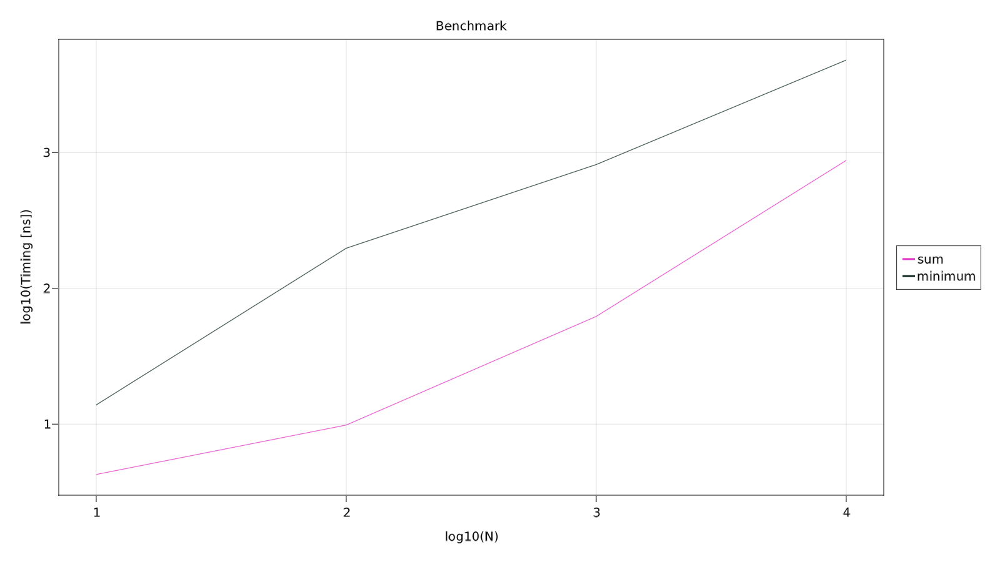

# BenchmarkPlots.jl

Benchmark functions with different amount of data and plot in one figure.

[](https://codecov.io/gh/JuliaAstroSim/BenchmarkPlots.jl)

## Install

In `Julia` `REPL`
```julia
]add BenchmarkPlots
```

## Usage

### Basic

```julia
using BenchmarkTools, Makie
scene, layout, df = benchmarkplot(
    [sum, minimum],
    rand,
    [10^i for i in 1:4],
)
display(scene)
display(df)
Makie.save("benchmark_sum_miminum.png", scene)
```



### More info

```julia
help?> benchmarkplot
search: benchmarkplot BenchmarkPlots

  benchmarkplot(functions::Array, gen::Function, NumData::Array{Int}; kw...)

  Benchmark multiple functions using different lengths of data generated by function gen. NumData is an Array or other iteratables. Returns a Tuple of scene. scene and layout are defined in Makie.

  Core Algorithm
  ≡≡≡≡≡≡≡≡≡≡≡≡≡≡≡≡

  For each element in NumData:

    1. gen generates data with length corresponded

    2. BenchmarkTools.@benchmark tunes each function in functions and restore timings in an array

    3. Plot figure

  Keywords
  ≡≡≡≡≡≡≡≡≡≡

    •  title: figure title. Default is "Benchmark"

    •  logscale: If true, plot axes in log10 scale. Default is true.

    •  xlabel: label of x-axis. Default is logscale ? "log10(N)" : "N"

    •  ylabel: label of y-axis. Default is logscale ? "log10(Timing [ns])" : "Timing [ns]"

    •  resolution: figure resolution. Default is (1600, 900)

    •  names: alternative names of testing functions. Default is string.(functions), which is exactly the same with function names

    •  colors: colors of each benchmark line. Default is nothing, meaning random colors are assigned to lines.

    •  savelog::Bool: If true, save processed data in csv. The name of logging file depends on analysis function

    •  savefolder: set the directory to save logging file

    •  stairplot: If true, plot line in stair style (which is more concrete). Default is true

  Examples
  ≡≡≡≡≡≡≡≡≡≡

  using BenchmarkPlots, Makie
  scene, layout, df = benchmarkplot(
      [sum, minimum],
      rand,
      [10^i for i in 1:4],
  )
  display(scene)
  display(df)
  Makie.save("benchmark_sum_miminum.png", scene)
```